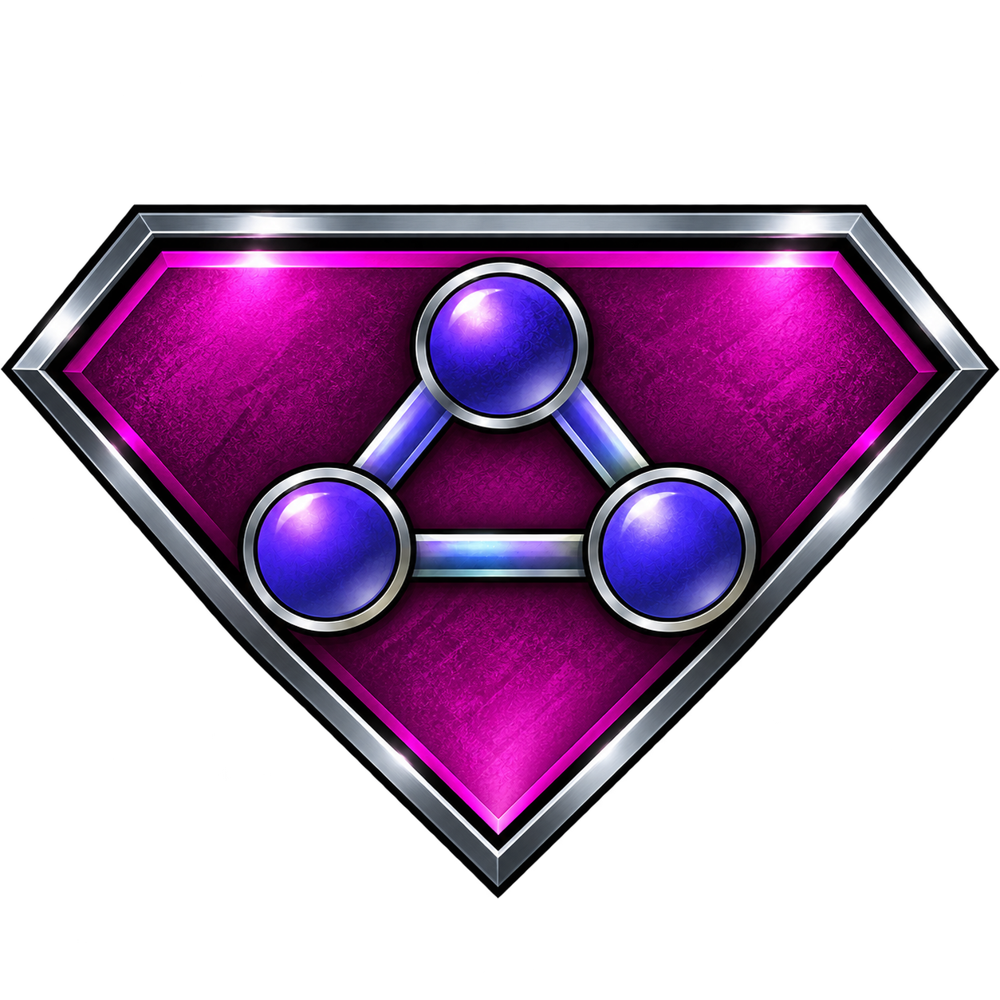

# FlaxPlaza
> We are web 3.

<!-- PROJECT LOGO -->
 

  

  <h3 align="center">FLAXPLAZA</h3>

  

     
    <a href="https://flaxware.github.io"><strong>Our website»</strong></a>
     
     
  

<!-- Description -->
Web 3.0 platform portal with security design first.

<!-- MANUAL -->
This page is all-in-one manual for secure modern web.

## Flaxware services:
- [Flaxware portal](https://flaxware.github.io/)
### Flax OS:
- [Flax system](https://github.com/flaxware/flax.system/)
> We are putting effort to create a single standard.

## E-mail and related services:
### Proton:
- [Proton login](https://account.proton.me/login)
- [E-mail](https://account.proton.me/mail)
- [Password manager](https://account.proton.me/pass)
- [Drive/Cloud](https://account.proton.me/drive)
> ⬆️PROTON SERVICES⬆️
- [Temp mail](https://temp-mail.org/en/)

## AI:
- [Duck AI](https://duck.ai/)
- [DeepL AI translator](https://www.deepl.com/en/translator)

## Search engines:
- [DuckDuckGO clearnet](https://duckduckgo.com)
- [DuckDuckGO onion](https://duckduckgogg42xjoc72x3sjasowoarfbgcmvfimaftt6twagswzczad.onion/)
- [Ahmia](https://ahmia.fi/)
- [Wikipedia](https://www.wikipedia.org/)
- [WikiLeaks](https://wikileaks.org/)
- [Reddit](https://www.reddit.com/)

## Tor:
- [Check Tor](https://check.torproject.org/)

## Osint:
- [Metadata reader](https://metadataview.com/)
- [IP trap](https://iplogger.org/)
- [who.is IP lookup](https://who.is/)
- [CVE search](https://www.cve.org/)

## Media:
- [Picture editing](https://www.photopea.com/)
